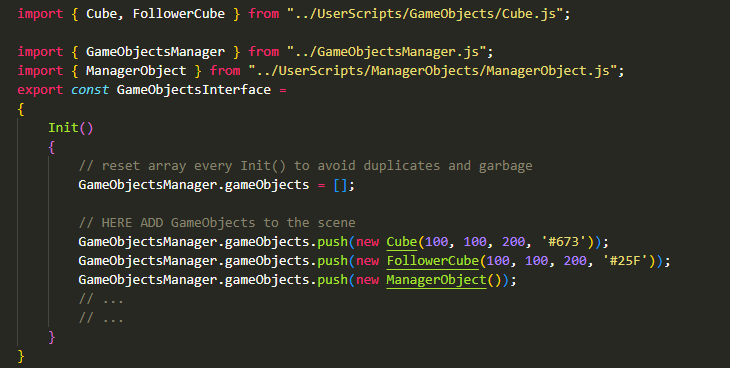

# MANUAL v1.0

This is a simplistic game engine written in vanilla JavaScript (i.e. no frameworks). It uses an HTML file with a canvas element to render. Note that in order to get a nice crisp image (not blurred) with the correct ratio, the dimensions of the canvas should be specified (the same of course) in both HTML and CSS files. The canvas element needs to have an id = "gameCanvas". If you want a different name, change the common.js file.

The game engine is designed to be modular, so that you have only to change very few files in order to make everything work. Now there are only two files that give you the power to make everything work: In the `InterfaceScripts/` directory, `GameObjectsInterface.js`, `GameStateInterface.js`. These two files manipulate the `GameStateManager` and `GameObjectsManager` modules.

## GameStateManager

### Game States
`GameStateManager` has a `gameState` property which is an object containing: `name`, `Update()` and `Render()`. The name is just an identifier, `Update()` and `Render()` are updating and rendering for the **current game state**. So make sure that everything that should be updating is `Updating()` 

```javascript
GameStateManager.gameState = GAMESTATE; /* the GameState object */
// put the GAMESTATE in a different file, in GameStates/<GAMESTATE>.js
const GAMESTATE = /* the name of the object */ 
{
  name: STRING_IDENTIFIER, /* useful for checks like if(GameStateManager.gameState.name == 'STRING_IDENTIFIER') */
  Update: function() {},
  Render: function() {}
}
```

Right now, all the modules that need to be `Updated()` are the following. As you extend the game engine, this list should increase :)

```javascript
Game.GameObjectsManager.Update(); // Update() all gameObjects
Game.GameStateManager.Update();   // Run all transition managers
```

### Transition Managers

`Transition Managers` are just checking functions. There can be as many of them as you need. Add them to `GameStateInterface.js` to the bottom of the file and make sure that you `push()` them in the `GameStateManager.transitionManagers` array in `GameStateInterface.Init()`. Also `bind()` them to `GameStateManager` in order to be able to access the `gameState` through `this`.

`Transition Managers` usually check for certain key presses or different and change `GameStateManager.gameState = <NEW_STATE>`

## GameObjectsManager
`GameObjectsManager.gameObjects` is an array containing all the `gameObjects`, no matter the type. In `GameObjectsManager.Update()` all of them are `Updated()`, and in `GameObjectsManager.Render()` all of them are Rendered() [^1]
* every `GameObject` needs to have these two functions `Update()` and `Render()`
* a `GameObject` class (type) can define and empty `Render()` or `Update()` if needed, but they must be defined to prevent errors

You can add `GameObjects` to the scene by `pushing()` them in the `GameObjectsManager.gameObjects` array. Open up `InterfaceScript/GameObjectsInterface.js` and in `Init()`, `push()` them like this:



`UserScripts/GameObjects` is the directory where you can add custom `GameObject` types. It's recommended to make a new file for each class and always to `extend` (inherit) from the `GameObject` class as it will contain the default `Update()` and `Render()`. If you want you can always redefine these methods in your class.

```javascript

import { GameObject } from './GameObject.js'

class MyCustomGameObject extends GameObject
{
	constructor(x, y, color)
	{
		super(x, y, 10, 10, color);
	}
	Update()
	{
		this.x++;
	}
	// Render() { /* custom rendering code */ }
	// I can redefine the Render() function too, but in this case the default Render() is just fine
}

```

[^1]: The `Update()` or `Render()` functions can be defined as empty in case there is no need for rendering or updating